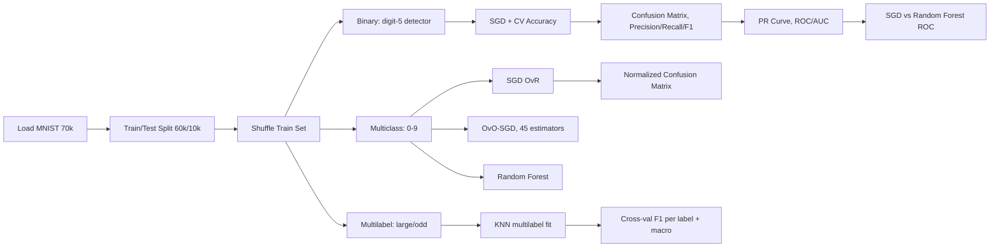

<div align="center">

# 🔢 MNIST Classification


Binary, multiclass, and multilabel classification on handwritten digits — with a focus on evaluation metrics, not just accuracy.

</div>

## TL;DR

| | |
|---|---|
| **Task** | Binary (digit-5 detector), multiclass (0–9), multilabel (large / odd) |
| **Dataset** | MNIST 784 (70,000 images, 28×28 px) via OpenML |
| **Best binary model** | Random Forest — AUC ≈ 0.99 (vs SGD ≈ 0.96) |
| **Multiclass models** | SGD (OvR), OvO-SGD (45 estimators), Random Forest |
| **Multilabel model** | KNN, macro F1 reported per label |
| **Key finding** | Accuracy alone is misleading on the imbalanced 5-detector (90% baseline from predicting "not 5") |

## 📂 Dataset

<details>
<summary>Click to expand</summary>

- **Source:** `sklearn.datasets.fetch_openml('mnist_784')`
- **Size:** 70,000 grayscale images, 28×28 px (784 features), flattened to pixel-intensity vectors
- **Labels:** digits 0–9
- **Split:** first 60,000 = train (shuffled to break ordering), last 10,000 = test — this is MNIST's standard, pre-defined split, not a random one
- **Derived targets used in this notebook:**
  - `y_train_5`: binary, digit == 5
  - `y_train` (multiclass): original 0–9 labels
  - `y_multilabel`: two binary columns — `is_large` (digit ≥ 7), `is_odd`

</details>

## 🔧 Pipeline



## 📊 Results

**Binary (digit-5 detector), 3-fold CV:**

| Metric | Value |
|---|---|
| SGD Accuracy | ~0.965 |
| Dummy baseline Accuracy | ~0.910 |
| Precision | 0.824 |
| Recall | 0.785 |
| F1 | 0.804 |
| SGD AUC | ~0.96 |
| Random Forest AUC | ~0.99 |

**Multiclass:** SGD (OvR, native), OvO-SGD (45 pairwise classifiers), Random Forest — evaluated with a normalized, diagonal-zeroed confusion matrix to highlight which digit pairs get confused (e.g. 4↔9, 3↔5 are the classic MNIST error pairs).

**Multilabel (KNN):** predicts `is_large` (≥7) and `is_odd` simultaneously; scored with per-label F1 and macro F1 via 3-fold `cross_val_predict`.


## 🚀 Usage

```bash
pip install -r requirements.txt
jupyter notebook mnist.ipynb
```

Run all cells top to bottom. `fetch_openml` downloads and caches MNIST on first run (needs internet).
